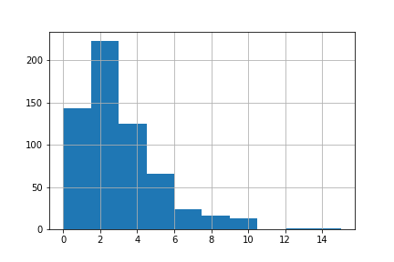
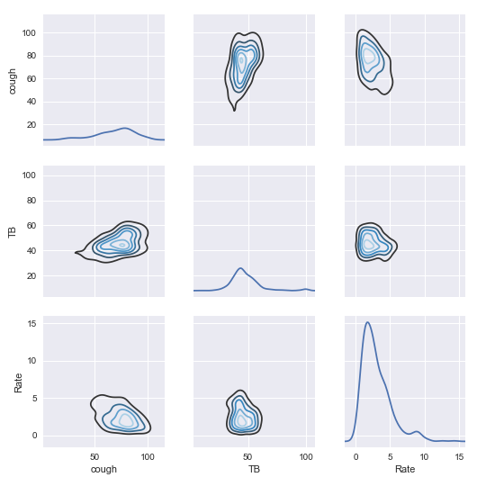

#Predicting Tuberculosis Rates with Google Trends

This project aims to predict tuberculosis (TB) rates within the 50 states of the United States based on the relative popularity of certain search terms according to Google Trends. For each state, I try to predict the rate of tuberculosis (total number of cases / population) in each year. The keywords I investigate in Google Trends are "TB", "tuberculosis", "cough", and "sex".

##Data

The data was obtained from [Google Trends](https://www.google.com/trends/) and the [CDC](https://gis.cdc.gov/grasp/nchhstpatlas/tables.html). To get a state-by-state breakdown, the Google Trends data was downloaded from the "Interest by subregion" section.

Google Trends' popularity measures are on a scale of 0 to 100. The state that had the most searches for the relevant term that year is assigned the value 100. All other states are assigned numbers between 0 to 100 based on how they compare to the state with the most searches.

The CDC data includes two different measures of tuberculosis incidence: the absolute number of cases per state, and the rate of incidence per state, which is the absolute number of cases divided by the state's population.

It is an interesting question what measure of tuberculosis occurrence can be best predicted using Google Trends data. Simply using the absolute number of cases might not work since the biggest states have a much higher absolute baseline of TB cases even in the absence of epidemics. Meanwhile, an epidemic in a small state might manifest as a smaller number of absolute cases than the baseline number of cases in a large state.

Since Google Trends normalizes the search term popularity relative to how popular it is in other states, I wondered if I should do something similar for the TB data. Thus, I created a new column in the dataset that corresponds to the proportion of total TB cases in a year that occurred in each state. For example, if California has 2000 cases and the total number of cases in the 50 states is 10000, then this new column would have 0.2 as the proportion for California. However, this new statistic I created was really difficult to predict, probably for the reasons pointed out above---that the proportions from big states dominated the data in a way that made variations in proportions from small states hard to predict. Absolute rates were also difficult to predict, probably for a similar reason. So I settled on predicting the rate of TB cases, i.e. the total number of cases / population

##Code
[clean.py](clean.py) contains the code I used to combine the CDC data and Google Trends data into one dataframe. [train.py](train.py) contains the code I used to evaluate different ways of modeling the data. The [iPython notebook](visualization.ipynb) contains the visualization code.

##Methods

Since I am using only four features to predict the rate, ensemble methods like random forests or boosted decision trees would be overkill. I investigated simpler methods, including linear regression, lasso and ridge regression, Elastic Net, kernel ridge regression, and K-nearest neighbors regression. Ultimately, the simplest method, a linear regression, performed similarly to the more complicated methods, and had a lower standard deviation for its mean squared deviation or R^2 values. All methods I investigated were tuned for optimal hyperparameters using Python's GridSearchCV function.

##Results

The coefficients for the linear regression fit are as follows:

* cough -0.04722595
* TB 0.04878188
* tuberculosis -0.00180526
* sex 0.00032854

From this, we can see that the search term "cough" is, surprisingly, negatively correlated with TB rates. "TB" is positively correlated, while the remaining two search terms have little correlation.

For the linear regression, I obtained a mean squared error of 3.494 with a standard deviation of 0.486, and an R^2 of 0.178 with a standard deviation of 0.060. The root mean squared error is 1.869.

How informative is this model? To get an idea, we can compare the root mean squared error with the distribution of TB rates:

According to the statistics given in the iPython notebook, 75% of data points have a TB rate below 4, and we can see from the above figure that there is a big hump from around 0-4 that probably represents the base rate of TB in most states.  We could reasonably expect states with epidemics to be on the tail end, say with an incidence of 8 or more. A root mean squared error of 1.869 would be informative for predicting these large values, so our model is not useless despite the small R^2 value.

To visualize the correlations between searches for "cough", searches for "TB", and actual rates of TB, I constructed a pair plot:

We can see the negative correlation between "cough" and TB rate by how, in the lower left diagram, the distribution of "cough" points downwards to the right---there is a tendency for lower rates of TB to go with higher search frequencies of "cough".

##Concluding Remarks
It is interesting both that searches for "cough" have a negative correlation with TB rates, and that searches for "TB" are much more predictive of TB rates than searches for "tuberculosis". It's possible that the latter fact could be due to the difficulty of spelling the word---perhaps using Google Trends data on common misspellings of "tuberculosis" would shed light on this. As for the negative correlation with "cough", one hypothesis is that most people searching for the term "cough" probably have a more common disease, such as the common cold. If there are negative correlations between any of these diseases and incidences of TB, that could explain the negative correlation between "cough" and TB rates. This issue requires further investigation.
